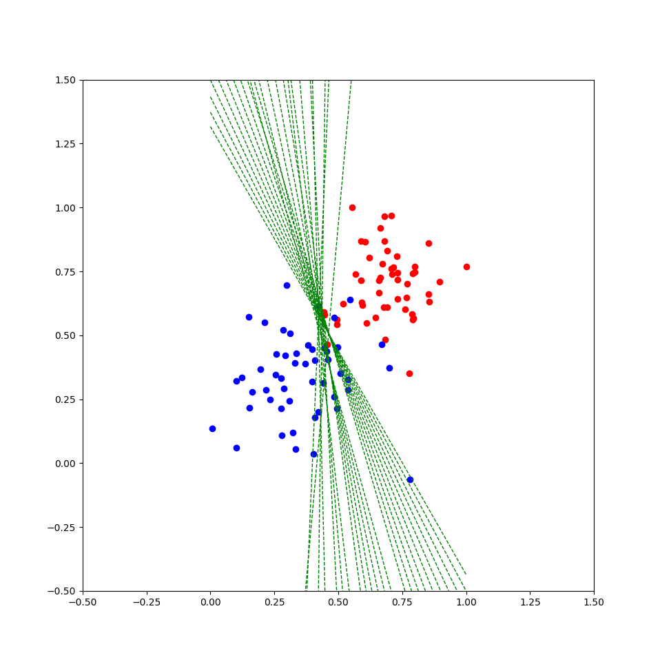

<p align="center">
  <a href="https://en.wikipedia.org/wiki/Perceptron" rel="noopener">
 </a>
</p>

<h1 align="center">Perceptron</h1>

<div align="center"></div>


<p align="center"> This is both an example of a simple perceptron implementation and an example of a 'dockerized' perceptron service.
    <br> 
</p>

## Table of Contents

- [About](#about)
- [Perceptron Implementation](#perceptron_impl)
- [Perceptron script ussage](#script_ussage)
- [Docker container](#dock_cont)
- [Author](#author)
- [Acknowledgments](#acknowledgement)

## About <a name = "about"></a>

This little project is in one hand an implementation example of the perceptron learning algorithm written in python and in the other hand an example of a 'dockerized' service that receives a set of 2D scattered points along with the class they belong to (i.e. '1' or '0' - take a look at the [data](./data.csv)) and then it trains the data to the perceptron implementation to find the line that better divides the data.

The docker image of this [docker] service example can be downloaded from [this](https://hub.docker.com/r/eindemwort/perceptron) docker hub repo:
```
docker pull eindemwort/perceptron
```


## Perceptron Implementation <a name = "perceptron_impl"></a>

The perceptron class implementation receives as parameters:
* a data frame (i.e. the set of 2D scattered points). This must be a .csv file
* a seed for the [numpy random state generator ](https://docs.scipy.org/doc/numpy-1.15.0/reference/generated/numpy.random.RandomState.html#numpy.random.RandomState). It must be of int data type
* a string to denote a relative path.

This perceptron implementation produces a .png file depicting a set of dashed lines to show the progress on the perceptron's training and the line that best divides the classes on the data. The perceptron implementation generates such .png file in the relative path denoted by the string passed to the perceptron class implementation (i.e. third parameter mentioned lines above).

Without going too much into the implementation details of the perceptron class, it is worth mentioning that in order to train a perceptron intance, its 'trainPerceptronAlgorithm' method must be called. This method receives the following arguments:
* learn_rate. It must be of float data type
* num_epochs. It must be of int data type

If not provided, this parameters default to 0.01 and 25 respectively.


### Perceptron script ussage <a name = "script_ussage"></a>

The perceptron script ussage:

```
perceptron.py [-i <input_cvsfile>][-l <float learning rate>][-e <int number of epochs][-s <int seed>][-p <int port tcp server]

You can also substitute the flags as follows:
        --input-data        vs. -i
        --learning-rate     vs. -l
        --num-epochs        vs. -e
        --seed              vs. -s
        --tcp-server-port   vs. -p
```

For default values of these parameters take a look at [the implementation](./perceptron.py).

Since gradient descent is at the heart of perceptrons, it might also be of interest to the reader to take a look at [this jupyter notebook](./GradientDescent.ipynb) for a better insight and comprehension of how it (i.e. gradient descent) works.

## Docker container <a name = "dock_cont"></a>

The docker image is built as follows:

```
docker build -t perceptron:1.0 .
```

When creating a docker container out of this image, the user should map the ports (both the host's and the docker container's) to be used.
```
docker run --rm -p 127.0.0.1:8080:8080 perceptron:1.0
```

The user can also pass the same [arguments of the perceptron script](#script_ussage).

## Author <a name = "author"></a>

- [@armhzjz](https://github.com/armhzjz)

Any hint or advice on how this could be improved are welcome!

## Acknowledgements <a name = "acknowledgement"></a>

 I took the original implementation of a perceptron algorithm from a course on Machine Learning I took on [Udacity](https://github.com/udacity).
